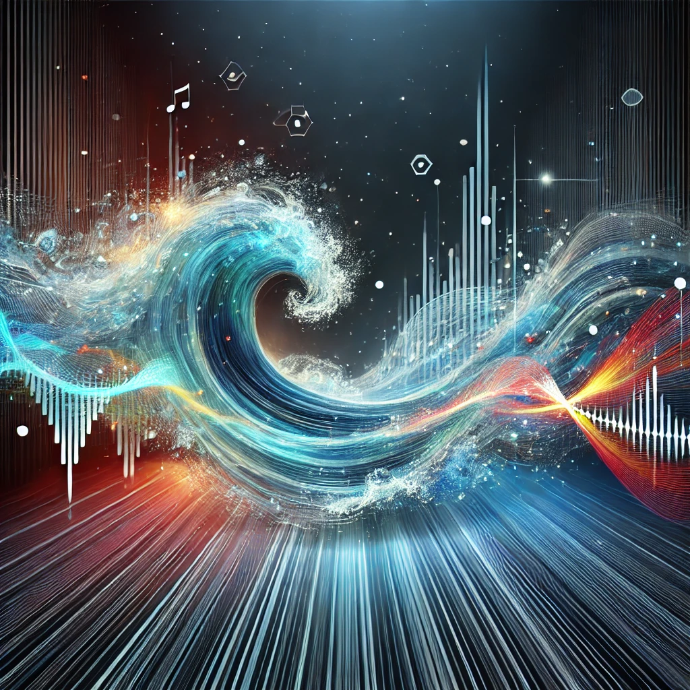
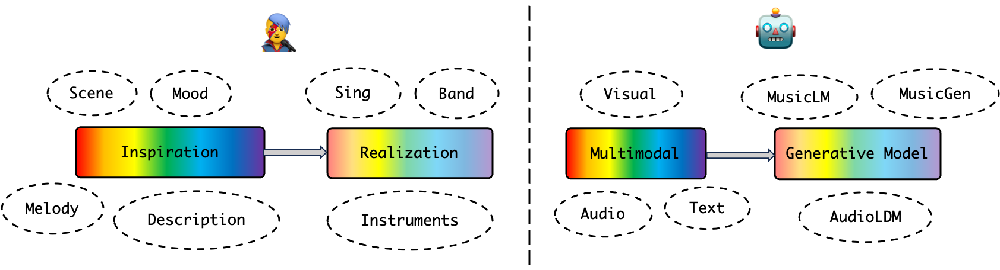
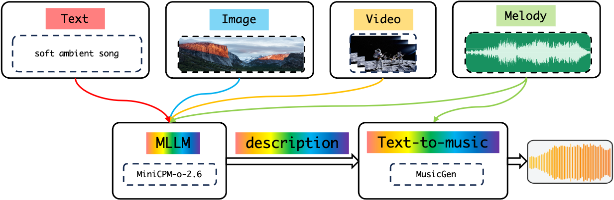
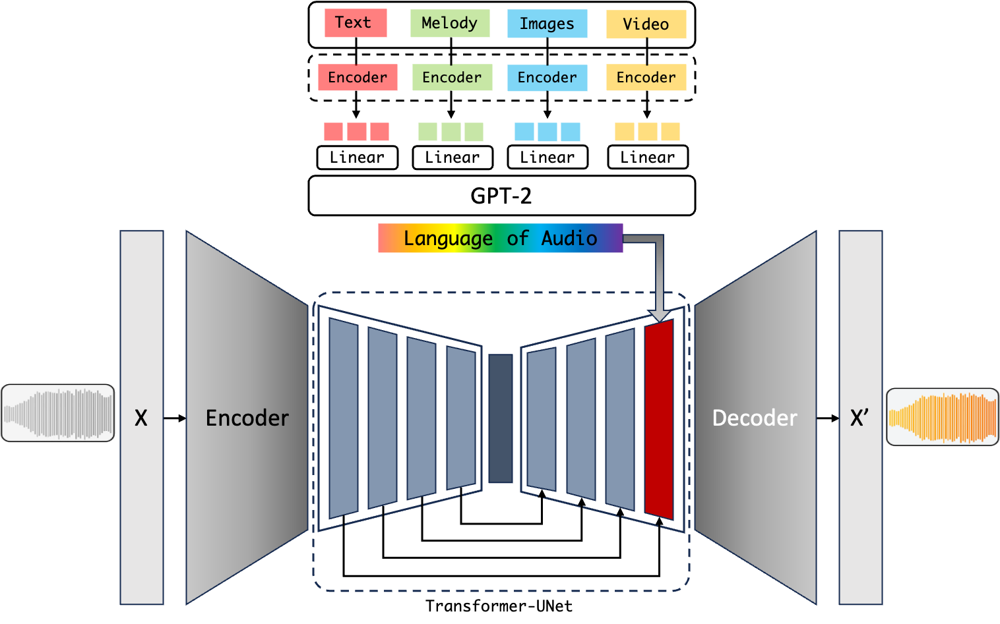
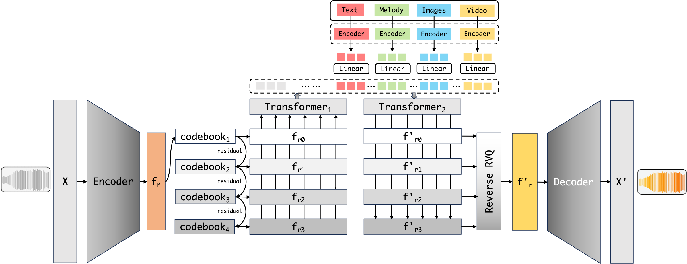
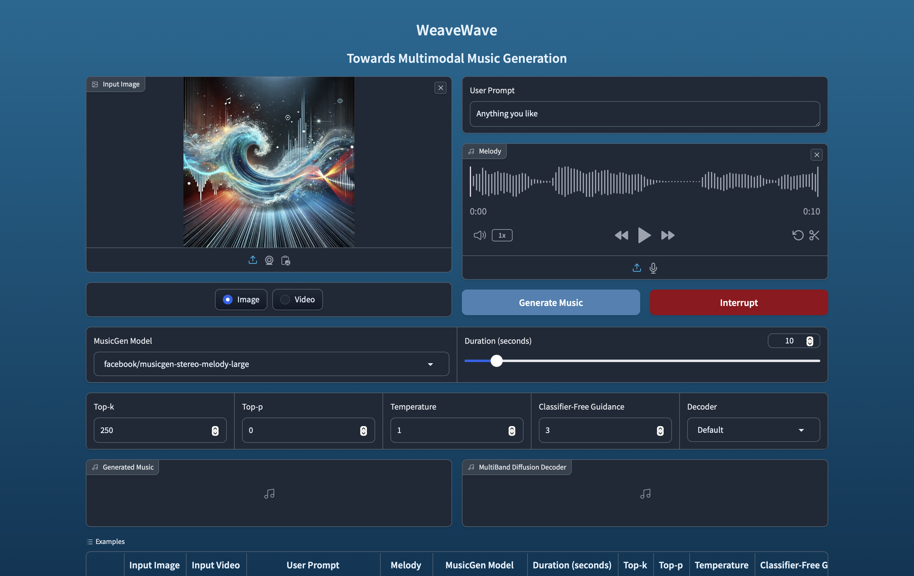

# WeaveWave: Towards Multimodal Music Generation

   

   <i>WeaveWave: Towards Multimodal Music Generation</i>

  

## Overview

Artificial Intelligence Generated Content (AIGC), as a next-generation content production method, is reshaping the possibilities in artistic creation. This project focuses on the vertical domain of music generation, exploring advanced models for music generation under multimodal conditions (text, images, videos).

**For humans**, music creation can be abstracted into two stages: **inspiration** and **implementation**. The former originates from the **fusion of diverse sensory experiences**: visual scenes stimulation, literary imagery resonance, auditory fragment association, and other cross-modal perceptions. The latter manifests as the process of concretizing inspiration through singing, instrumental performance, etc.

**For machines**, can artificial intelligence music creation mimic these two stages? We believe that the task of **multimodal music generation** precisely simulates "inspiration" and "implementation," where "inspiration" can be viewed as multimodal data, and "implementation" as a music generation model.

   

   <i>Music creation: humans and machines</i>

However, research on multimodal music generation has not yet garnered widespread attention, with most existing work confined to music understanding and generation within a single modality. This limitation clearly fails to fully capture the complex multimodal sources of inspiration in music creation.

To address this gap, we first implemented a **text-bridging** strategy, harnessing the capabilities of existing multimodal large language models (MLLMs) and text-to-music generation systems. Building on this foundation, we proposed two candidate end-to-end architectures and developed a scalable training pipeline based on [MusicGen-Style](https://musicgenstyle.github.io). This methodological exploration culminated in **WeaveWave**, a unified music generation framework designed to integrate multimodal inputs through a cohesive generative process.

   

   <i>Text-Bridging</i>

   

   <i>End-to-End 1, based on AudioLDM2</i>

   

   <i>End-to-End 2, based on MusicGen</i>

## Features

- **Multimodal Music Generation**: Create music from text, music, images, or video inputs
- **Integration Framework**: Leverages existing multimodal large language models (MLLM) and text-to-music (T2M) models
- **(🏗️)Custom Training Pipeline**: Specialized pipeline for multimodal music generation
- **(🏗️)Comprehensive Evaluation Tools**: Metrics for assessing music quality and multimodal coherence

## Project Status

**🏗️ Work in Progress**

- ✅ Architecture design
- ✅ Propose training pipeline based on [MusicGen-Style](https://musicgenstyle.github.io)
- 🔄 Dataset preparation and curation
- 🔄 Model training and fine-tuning
- 🔄 Evaluation metrics design
- ✅ Web app development for demo and testing (using Gradio)

## Installation

🔄 will be updated soon

## Demo

In this [demo](assets/media/demo.mp4), we showcase the WeaveWave web app implementing our text-bridging framework. It integrates [MiniCPM-o-2.6](https://github.com/OpenBMB/MiniCPM-o) for multimodal conditions integeration and Meta’s [MusicGen](https://github.com/facebookresearch/audiocraft/blob/main/docs/MUSICGEN.md) for music generation.

   

  <i>WeaveWave: Web app built with Gradio</i>

## References

[1]. Copet, J., Kreuk, F., Gat, I., Remez, T., Kant, D., Synnaeve, G., Adi, Y., & Défossez, A. (2024). Simple and controllable music generation. arXiv:2306.05284.

[2] Rouard, S., Adi, Y., Copet, J., Roebel, A., & Défossez, A. (2024). Audio conditioning for music generation via discrete bottleneck features. arXiv:2407.12563.

[3]. Liu, H., Yuan, Y., Liu, X., Mei, X., Kong, Q., Tian, Q., Wang, Y., Wang, W., Wang, Y., & Plumbley, M. D. (2024). AudioLDM 2: Learning holistic audio generation with self-supervised pretraining. arXiv:2308.05734.

[4]. Rinaldi, I., Fanelli, N., Castellano, G., & Vessio, G. (2024). Art2Mus: Bridging visual arts and music through cross-modal generation. arXiv:2410.04906.

[5] MiniCPM-o Team. (2025). MiniCPM-o: A GPT-4.o-level MLLM for vision, speech, and multimodal live streaming on your phone. OpenBMB. [Link](https://openbmb.notion.site/MiniCPM-o-2-6-A-GPT-4o-Level-MLLM-for-Vision-Speech-and-Multimodal-Live-Streaming-on-Your-Phone-185ede1b7a558042b5d5e45e6b237da9)