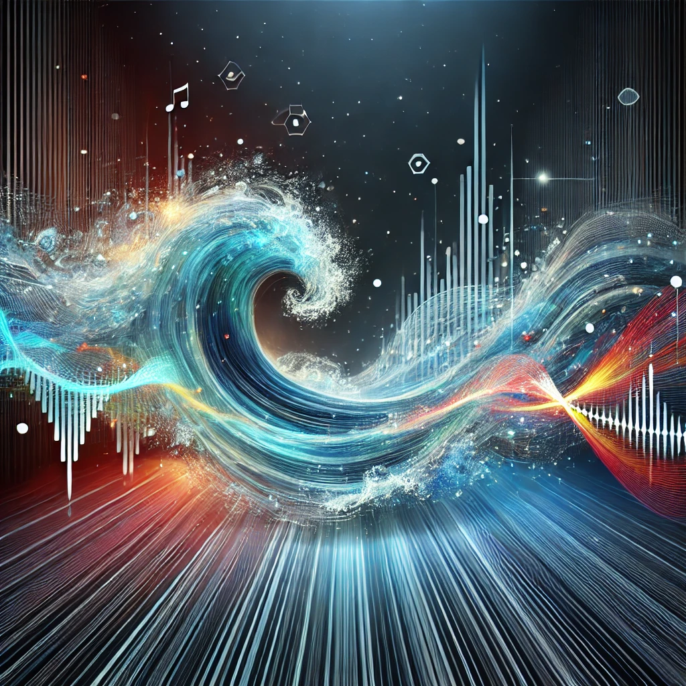
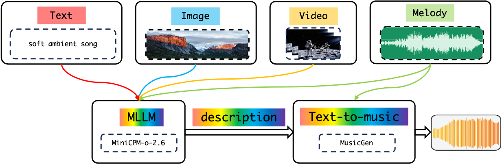
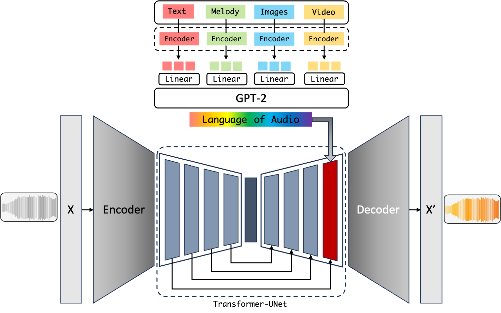
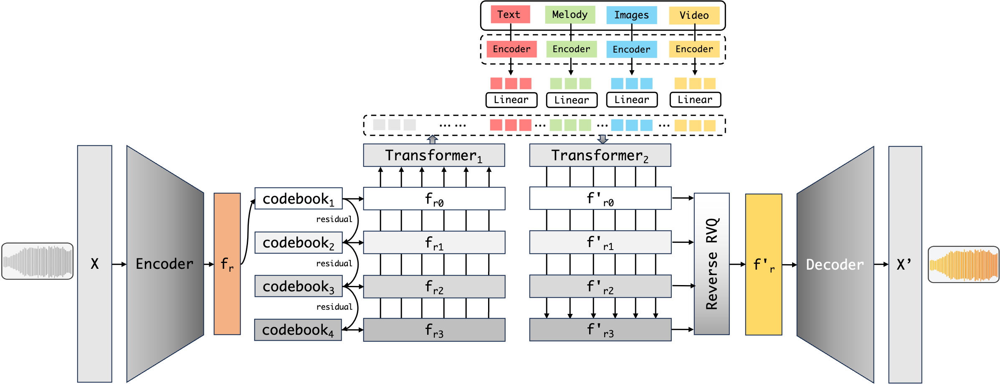
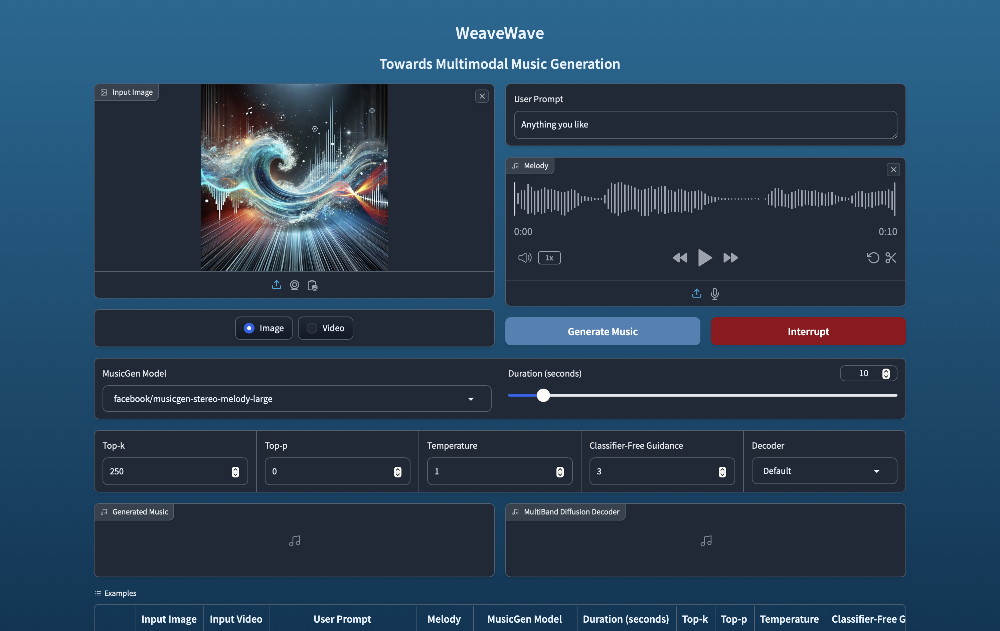

# WeaveWave: Towards Multimodal Music Generation

<div align="center">
   
</div>

<div align="center">


</div>

## Abstract

WeaveWave is a multimodal music generation system that converts text, images, and video into music. It employs a **text-bridging** strategy: a multimodal large language model (Gemma-3-12b-it) first generates rich musical descriptions from arbitrary input modalities, which then condition a MusicGen-Style model (AudioCraft) for audio synthesis. This decoupled architecture enables flexible integration of new modalities and generation backends while maintaining high-quality output at 32 kHz. We additionally provide a scalable training pipeline based on MusicGen-Style \[2\] and an interactive Gradio demo for real-time experimentation.

## Architecture

```
Input (Text / Image / Video)
  → MLLM Backend (Gemma-3-12b-it via FastAPI)
    → Music description text
  → MusicGen-Style (AudioCraft)
    → Text conditioning  (T5-base, frozen)
    → Style conditioning (MERT, 6 codebooks, 5 Hz, 3 s excerpts)
    → Optional melody conditioning (chroma features)
    → EnCodec 32 kHz decoder
    → Optional MultiBand Diffusion post-processing
  → WAV output (32 kHz, loudness-normalized)
```

<div align="center">
   
</div>
<p align="center"><i>Text-Bridging pipeline: MLLM + MusicGen</i></p>

The text-bridging approach builds on MusicGen \[1\] and its style-conditioning extension \[2\], using Gemma-3 \[3\] as the multimodal front-end. Compared to fully end-to-end architectures (see alternatives based on AudioLDM2 \[4\] and MusicGen below), text-bridging offers modularity at the cost of an additional inference step.

<div align="center">
   
   
</div>
<p align="center"><i>Alternative end-to-end architectures explored during development</i></p>

## Installation

```bash
# Clone the repository (with AudioCraft submodule)
git clone --recurse-submodules https://github.com/audiofool/WeaveWave.git
cd WeaveWave

# Install the package with all dependencies
pip install -e ".[dev,demo]"

# Install AudioCraft from the vendored submodule
pip install -e repos/audiocraft
```

> **Requirements:** Python 3.9+, PyTorch 2.3.1+, CUDA-capable GPU recommended.

## Quick Start

### Generate music from the demo UI

```bash
# Terminal 1: Start the MLLM backend
weavewave-mllm-server

# Terminal 2: Start the Gradio frontend
weavewave-demo
```

Then open `http://127.0.0.1:7860` in your browser.

### Training

```bash
# Prepare a dummy dataset for testing
weavewave-prepare-data --create_dummy --dummy_samples 100

# Launch training
weavewave-train

# Or use the full runner with options
weavewave-run-training --dummy_data --dummy_samples 100 --gpu 0 1
```

### Evaluation

```bash
weavewave-evaluate \
    --eval_text2music \
    --model_path ./outputs/latest_model \
    --output_dir ./outputs/evaluation \
    --gpu 0
```

Evaluation modes: `--eval_text2music`, `--eval_style2music`, `--eval_style_and_text2music`.

## Project Structure

```
WeaveWave/
├── weavewave/                  # Main Python package
│   ├── core/                   # Shared config, types, logging, clients
│   │   ├── config.py           # AppConfig, PromptConfig
│   │   ├── types.py            # GenerationConfig, MLLMServerConfig
│   │   ├── logging.py          # Centralized logging setup
│   │   ├── mllm_client.py      # HTTP client for MLLM service
│   │   └── music_generator.py  # MusicGen wrapper
│   ├── training/               # Training pipeline
│   │   ├── train.py            # MusicGen-Style training script
│   │   └── runner.py           # High-level training orchestrator
│   ├── evaluation/             # Evaluation pipeline
│   │   └── evaluate.py         # Multi-mode evaluation
│   ├── data/                   # Dataset preparation
│   │   └── prepare_dataset.py  # Dummy & real dataset tools
│   └── serving/                # Web application
│       ├── mllm_server.py      # FastAPI MLLM backend
│       ├── app.py              # Gradio frontend
│       └── theme.py            # Ocean-themed UI
├── config/                     # Hydra YAML configurations
│   ├── musicgen_style_32khz.yaml
│   └── model/musicgen_model.yaml
├── tests/                      # Test suite
├── repos/audiocraft/           # AudioCraft (git submodule)
├── assets/                     # Logo, media, examples
├── pyproject.toml              # Package metadata & tool config
├── Dockerfile                  # Multi-stage container build
└── docker-compose.yml          # Service orchestration
```

## Environment Variables

| Variable | Purpose | Default |
|----------|---------|---------|
| `WEAVEWAVE_MLLM_URL` | MLLM service endpoint | `http://127.0.0.1:8001` |
| `WEAVEWAVE_DEFAULT_MUSIC_MODEL` | Default MusicGen checkpoint | `facebook/musicgen-stereo-melody-large` |
| `WEAVEWAVE_MLLM_MODEL` | MLLM model identifier | `google/gemma-3-12b-it` |
| `WEAVEWAVE_MLLM_DEVICE` | MLLM device | `cuda` |
| `CUDA_VISIBLE_DEVICES` | GPU selection | — |

## Demo

<div align="center">
   <a href="assets/media/demo.mp4">
      
   </a>
</div>
<p align="center"><i>WeaveWave web application built with Gradio</i></p>

## Citation

```bibtex
@software{weavewave2025,
    title  = {WeaveWave: Towards Multimodal Music Generation},
    author = {Audiofool},
    year   = {2025},
    url    = {https://github.com/audiofool/WeaveWave},
}
```

## References

\[1\] Copet, J., Kreuk, F., Gat, I., Remez, T., Kant, D., Synnaeve, G., Adi, Y., & Défossez, A. (2024). Simple and controllable music generation. *arXiv:2306.05284*.

\[2\] Rouard, S., Adi, Y., Copet, J., Roebel, A., & Défossez, A. (2024). Audio conditioning for music generation via discrete bottleneck features. *arXiv:2407.12563*.

\[3\] Google. (2025). Gemma 3 Technical Report. *arXiv:2503.19786*.

\[4\] Liu, H., Yuan, Y., Liu, X., Mei, X., Kong, Q., Tian, Q., Wang, Y., Wang, W., Wang, Y., & Plumbley, M. D. (2024). AudioLDM 2: Learning holistic audio generation with self-supervised pretraining. *arXiv:2308.05734*.

\[5\] Rinaldi, I., Fanelli, N., Castellano, G., & Vessio, G. (2024). Art2Mus: Bridging visual arts and music through cross-modal generation. *arXiv:2410.04906*.

## License

This project is licensed under the [MIT License](LICENSE).
