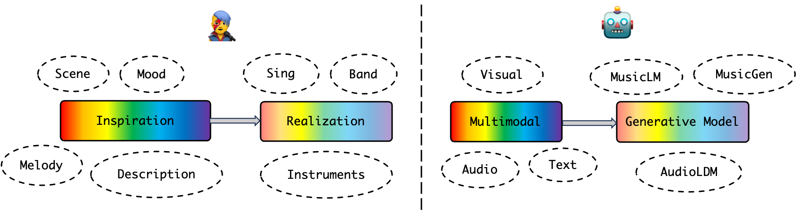

# WeaveWave: Towards Multimodal Music Generation

<div align="center">
   
</div>

<div align="center">

[](https://www.python.org/)
[](https://pytorch.org/)
[](LICENSE)
[](https://github.com/Audiofool934/WeaveWave/actions/workflows/ci.yml)

</div>

## Abstract

WeaveWave is a multimodal music generation framework that synthesizes music from text, images, and video. It employs a **text-bridging** strategy: a multimodal large language model (Gemma-3-12b-it \[3\]) generates rich musical descriptions from arbitrary input modalities, which then condition a MusicGen-Style model \[2\] for audio synthesis at 32 kHz. This decoupled design enables modular integration of new modalities and generation backends. We further provide a scalable training pipeline based on MusicGen-Style and an interactive Gradio demo for real-time experimentation.

## Motivation

**For humans**, music creation can be abstracted into two stages: **inspiration** and **implementation**. Inspiration originates from the fusion of diverse sensory experiences — visual scenes, literary imagery, auditory fragments, and other cross-modal perceptions. Implementation manifests as the process of concretizing that inspiration through performance.

**For machines**, can AI music creation mimic these two stages? We believe that **multimodal music generation** precisely simulates this process — where "inspiration" corresponds to multimodal input data, and "implementation" to a music generation model.

<div align="center">
   
</div>
<p align="center"><i>Music creation: humans and machines</i></p>

However, research on multimodal music generation has not yet garnered widespread attention, with most existing work confined to understanding and generation within a single modality. To address this gap, we implemented a text-bridging strategy harnessing existing MLLMs and text-to-music systems, proposed two candidate end-to-end architectures, and developed a training pipeline based on MusicGen-Style \[2\]. This exploration culminated in **WeaveWave** — a unified framework designed to integrate multimodal inputs through a cohesive generative process.

## Architecture

<div align="center">
   
</div>
<p align="center"><i>Text-Bridging: MLLM generates music descriptions from multimodal input, MusicGen synthesizes audio</i></p>

The text-bridging approach builds on MusicGen \[1\] and its style-conditioning extension \[2\], using Gemma-3 \[3\] as the multimodal front-end. The pipeline consists of two stages:

1. **Description generation** — A multimodal LLM (Gemma-3-12b-it) interprets the input (text, image, or video) and produces a concise music description capturing mood, rhythm, genre, and instrumentation.
2. **Audio synthesis** — MusicGen-Style conditions on the generated description via a frozen T5-base text encoder, with optional style conditioning (MERT-based, 6 codebooks at 5 Hz) and melody conditioning (chroma features). Audio is decoded through EnCodec at 32 kHz with optional MultiBand Diffusion post-processing.

We also explored two end-to-end alternatives during development:

<div align="center">
   
</div>
<p align="center"><i>End-to-End approach 1: based on AudioLDM2 [4]</i></p>

<div align="center">
   
</div>
<p align="center"><i>End-to-End approach 2: based on MusicGen [1]</i></p>

## Demo

<div align="center">
   <a href="assets/media/demo.mp4">
      
   </a>
</div>
<p align="center"><i>Click to view demo — WeaveWave web application built with Gradio</i></p>

**Key features:**
- Generate music from **text prompts**, **images**, or **video** via a unified interface
- Choose from 10 MusicGen model variants (mono/stereo, small to large)
- Optional **melody conditioning** from uploaded audio (chroma-based)
- Optional **MultiBand Diffusion** decoding for enhanced audio quality
- Configurable generation parameters (duration, top-k, top-p, temperature, CFG)

## Installation

```bash
# Clone with submodules
git clone --recurse-submodules https://github.com/Audiofool934/WeaveWave.git
cd WeaveWave

# Install the package (with demo and dev extras)
pip install -e ".[dev,demo]"

# Install AudioCraft from the vendored submodule
pip install -e repos/audiocraft
```

> **Requirements:** Python 3.9+, PyTorch 2.3.1+, CUDA-capable GPU recommended.

## Quick Start

### Launch the demo

```bash
# Terminal 1 — MLLM backend (Gemma-3-12b-it on port 8001)
weavewave-mllm-server

# Terminal 2 — Gradio frontend (port 7860)
weavewave-demo
```

Open [http://127.0.0.1:7860](http://127.0.0.1:7860) in your browser.

### Training pipeline

```bash
# Prepare a dummy dataset
weavewave-prepare-data --create_dummy --dummy_samples 100

# Train MusicGen-Style
weavewave-train

# Or use the runner with full options
weavewave-run-training --dummy_data --dummy_samples 100 --gpu 0 1
```

### Evaluation

```bash
weavewave-evaluate \
    --eval_text2music \
    --model_path ./outputs/latest_model \
    --output_dir ./outputs/evaluation \
    --gpu 0
```

Supported modes: `--eval_text2music`, `--eval_style2music`, `--eval_style_and_text2music`.

### Docker

```bash
docker compose up
```

This starts the MLLM backend and Gradio frontend as separate services.

## Project Structure

```
WeaveWave/
├── weavewave/                  # Main Python package
│   ├── core/                   # Config, types, logging, clients
│   │   ├── config.py           # AppConfig, PromptConfig
│   │   ├── types.py            # GenerationConfig, MLLMServerConfig
│   │   ├── logging.py          # Centralized logging
│   │   ├── mllm_client.py      # HTTP client for MLLM service
│   │   └── music_generator.py  # MusicGen wrapper + MultiBand Diffusion
│   ├── training/               # Training pipeline
│   │   ├── train.py            # MusicGen-Style training
│   │   └── runner.py           # Data prep + training orchestrator
│   ├── evaluation/             # Multi-mode evaluation
│   │   └── evaluate.py
│   ├── data/                   # Dataset preparation
│   │   └── prepare_dataset.py
│   └── serving/                # Web application
│       ├── mllm_server.py      # FastAPI backend (Gemma-3)
│       ├── app.py              # Gradio frontend
│       └── theme.py            # Ocean-themed UI
├── config/                     # Hydra YAML configurations
├── tests/                      # Test suite (pytest)
├── repos/audiocraft/           # Meta AudioCraft (git submodule)
├── pyproject.toml              # Package metadata & dependencies
├── Dockerfile                  # Multi-stage build
└── docker-compose.yml          # Service orchestration
```

## Environment Variables

| Variable | Purpose | Default |
|----------|---------|---------|
| `WEAVEWAVE_MLLM_URL` | MLLM service endpoint | `http://127.0.0.1:8001` |
| `WEAVEWAVE_DEFAULT_MUSIC_MODEL` | Default MusicGen checkpoint | `facebook/musicgen-stereo-melody-large` |
| `WEAVEWAVE_MLLM_MODEL` | MLLM model identifier | `google/gemma-3-12b-it` |
| `WEAVEWAVE_MLLM_DEVICE` | MLLM inference device | `cuda` |
| `CUDA_VISIBLE_DEVICES` | GPU selection | — |

## Citation

```bibtex
@software{weavewave2025,
    title  = {WeaveWave: Towards Multimodal Music Generation},
    author = {Audiofool},
    year   = {2025},
    url    = {https://github.com/Audiofool934/WeaveWave},
}
```

## References

\[1\] Copet, J., Kreuk, F., Gat, I., Remez, T., Kant, D., Synnaeve, G., Adi, Y., & Défossez, A. (2024). Simple and controllable music generation. *NeurIPS 2024*. [arXiv:2306.05284](https://arxiv.org/abs/2306.05284)

\[2\] Rouard, S., Adi, Y., Copet, J., Roebel, A., & Défossez, A. (2024). Audio conditioning for music generation via discrete bottleneck features. *ISMIR 2024*. [arXiv:2407.12563](https://arxiv.org/abs/2407.12563)

\[3\] Google. (2025). Gemma 3 Technical Report. [arXiv:2503.19786](https://arxiv.org/abs/2503.19786)

\[4\] Liu, H., Yuan, Y., Liu, X., Mei, X., Kong, Q., Tian, Q., Wang, Y., Wang, W., Wang, Y., & Plumbley, M. D. (2024). AudioLDM 2: Learning holistic audio generation with self-supervised pretraining. *IEEE/ACM TASLP*. [arXiv:2308.05734](https://arxiv.org/abs/2308.05734)

\[5\] Rinaldi, I., Fanelli, N., Castellano, G., & Vessio, G. (2024). Art2Mus: Bridging visual arts and music through cross-modal generation. [arXiv:2410.04906](https://arxiv.org/abs/2410.04906)

## License

This project is licensed under the [MIT License](LICENSE).
