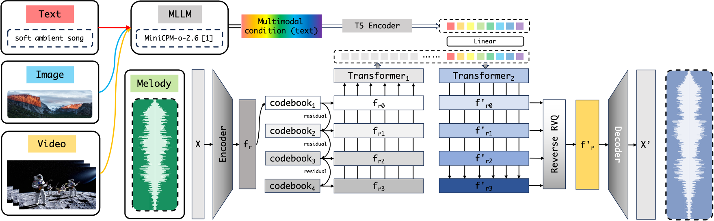

# WeaveWave: Towards Multimodal Music Generation
# WeaveWave: 探索多模态音乐生成

<div align="center">
   
</div>
<p align="center">
   <i>WeaveWave: Towards Multimodal Music Generation</i>
</p>

<div align="center">
  
[English](#overview) | [中文](#概述)
  


</div>

## Overview

Artificial Intelligence Generated Content (AIGC), as a next-generation content production method, is reshaping the possibilities in artistic creation. This project focuses on the vertical domain of music generation, exploring advanced models for music generation under multimodal conditions (text, images, videos).

**For humans**, music creation can be abstracted into two stages: **inspiration** and **implementation**. The former originates from the **fusion of diverse sensory experiences**: visual scenes stimulation, literary imagery resonance, auditory fragment association, and other cross-modal perceptions. The latter manifests as the process of concretizing inspiration through singing, instrumental performance, etc.

**For machines**, can artificial intelligence music creation mimic these two stages? We believe that the task of **multimodal music generation** precisely simulates "inspiration" and "implementation," where "inspiration" can be viewed as multimodal data, and "implementation" as a music generation model.

<div align="center">
   
</div>
<p align="center">
   <i>Music creation: humans and machines</i>
</p>

However, research on multimodal music generation has not yet garnered widespread attention, with most existing work confined to music understanding and generation within a single modality. This limitation clearly fails to fully capture the complex multimodal sources of inspiration in music creation.

To address this gap, we have adopted a **text-bridging** strategy, leveraging the potential of existing multimodal large language models and text-to-music generation models. This approach has led to the development of WeaveWave, a comprehensive music generation framework that integrates multimodal inputs.

<div align="center">
   
</div>
<p align="center">
   <i>WeaveWave：文本桥接</i>
</p>

## Features

- **Text-and-Style-to-Music Generation**: Generate music based on both textual descriptions and style references
- **Built on Facebook's MusicGen-Style**: Leverages state-of-the-art architecture from AudioCraft
- **Multimodal Input Support**: Process and combine information from various modalities
- **Customizable Training Pipeline**: Flexible configuration for different training scenarios
- **Comprehensive Evaluation Tools**: Assess music generation quality across different input conditions

## Project Status

⚠️ **Work in Progress**: This project is currently under active development.

- ✅ Framework design and architecture
- ✅ Basic training pipeline implementation
- ✅ Evaluation metrics design
- 🔄 Dataset preparation and curation (in progress)
- 🔄 Model training and fine-tuning (in progress)
- 🔄 Multimodal integration and testing (in progress)

## Installation

### Requirements

- Python 3.9+
- PyTorch 2.1.0
- CUDA-compatible GPU with at least 8GB memory (16GB+ recommended)

### Setup

1. Clone this repository and the AudioCraft submodule:

```bash
git clone https://github.com/yourusername/WeaveWave.git
cd WeaveWave
git clone https://github.com/facebookresearch/audiocraft.git
```

2. Install dependencies:

```bash
pip install -r requirements.txt
```

3. Install AudioCraft:

```bash
cd audiocraft
pip install -e .
cd ..
```

## Dataset

We are currently preparing a comprehensive multimodal music dataset for training. For now, the project includes a dummy dataset generator for testing purposes.

To generate a dummy dataset:

```bash
python prepare_dataset.py --create_dummy --dummy_samples 100
```

## Training

WeaveWave uses Facebook's AudioCraft framework for training, focusing on the MusicGen-Style model architecture.

### Quick Start

```bash
# Generate dummy dataset and start training
python run_training.py --dummy_data --dummy_samples 100
```

### Advanced Configuration

To train with custom settings:

```bash
# Using a specific GPU
python run_training.py --gpu 0 --source_data /path/to/your/data

# View all options
python run_training.py --help
```

## Evaluation

To evaluate a trained model:

```bash
# Basic text-to-music evaluation
python evaluate.py --eval_text2music --model_path ./outputs/latest_model

# Style-to-music evaluation
python evaluate.py --eval_style2music --audio_dir ./eval_samples/styles

# Combined text-and-style-to-music evaluation
python evaluate.py --eval_style_and_text2music --text_file ./eval_samples/prompts.txt --audio_dir ./eval_samples/styles
```

## Demo

<div align="center">
   <a href="assets/media/demo.mp4">
      
   </a>
</div>
<p align="center">
  <i>WeaveWave: Web app built with Gradio</i>
</p>

## Project Structure

```
WeaveWave/
├── assets/               # Images, logos, and media files
├── audiocraft/           # Facebook's AudioCraft submodule
├── config/               # Configuration files
│   ├── model/            # Model configurations
│   └── musicgen_style_32khz.yaml  # Main training configuration
├── data/                 # Dataset directory
├── outputs/              # Training outputs and checkpoints
├── evaluate.py           # Evaluation script
├── prepare_dataset.py    # Dataset preparation utilities
├── run_training.py       # Training launcher script
├── train.py              # Main training script
└── requirements.txt      # Python dependencies
```

## Citation

```
@misc{weavewave2024,
  author = {WeaveWave Team},
  title = {WeaveWave: Towards Multimodal Music Generation},
  year = {2024},
  publisher = {GitHub},
  howpublished = {\url{https://github.com/yourusername/WeaveWave}}
}
```

## Acknowledgements

- This project builds upon [Facebook's AudioCraft](https://github.com/facebookresearch/audiocraft)
- Inspired by [MusicGen](https://github.com/facebookresearch/audiocraft/blob/main/docs/MUSICGEN.md) and [MusicGen-Style](https://github.com/facebookresearch/audiocraft/blob/main/docs/MUSICGEN_STYLE.md)

## License

This project is licensed under the MIT License - see the LICENSE file for details.

---

# 概述

人工智能生成内容（AIGC）作为新一代内容生产方式，正在重塑艺术创作领域的可能性。本项目专注于音乐生成的垂直领域，探索在多模态条件（文本、图像、视频）下的音乐生成模型。

**对于人类**，音乐创作可以抽象为两个阶段：**灵感**和**实现**。前者源于**多种感官体验的融合**：视觉场景的刺激、文学意象的共鸣、听觉片段的联想以及其他跨模态感知。后者表现为通过演唱、乐器演奏等方式将灵感具体化的过程。

**对于机器**，人工智能音乐创作能否模仿这两个阶段？我们认为，**多模态音乐生成**任务正是对"灵感"和"实现"的模拟，其中"灵感"可以视为多模态数据，而"实现"则是音乐生成模型。

<div align="center">
   
</div>
<p align="center">
   <i>音乐创作：人类与机器</i>
</p>

然而，多模态音乐生成的研究尚未引起广泛关注，现有大部分工作局限于单一模态内的音乐理解和生成。这一局限性显然无法充分捕捉音乐创作中复杂的多模态灵感来源。

为了解决这一差距，我们采用了**文本桥接**策略，利用现有多模态大型语言模型和文本到音乐生成模型的潜力。这一方法促成了WeaveWave的开发，这是一个集成多模态输入的综合音乐生成框架。

<div align="center">
   
</div>
<p align="center">
   <i>WeaveWave：文本桥接</i>
</p>

## 功能特点

- **文本与风格到音乐生成**：基于文本描述和风格参考同时生成音乐
- **基于Facebook的MusicGen-Style**：利用AudioCraft的最先进架构
- **多模态输入支持**：处理并结合来自各种模态的信息
- **可定制的训练流程**：针对不同训练场景的灵活配置
- **全面的评估工具**：评估不同输入条件下的音乐生成质量

## 项目状态

⚠️ **正在进行中**：本项目目前正在积极开发中。

- ✅ 框架设计和架构
- ✅ 基本训练流程实现
- ✅ 评估指标设计
- 🔄 数据集准备和整理（进行中）
- 🔄 模型训练和微调（进行中）
- 🔄 多模态整合和测试（进行中）

## 安装

### 要求

- Python 3.9+
- PyTorch 2.1.0
- 兼容CUDA的GPU，至少8GB内存（推荐16GB+）

### 设置

1. 克隆此仓库和AudioCraft子模块：

```bash
git clone https://github.com/yourusername/WeaveWave.git
cd WeaveWave
git clone https://github.com/facebookresearch/audiocraft.git
```

2. 安装依赖：

```bash
pip install -r requirements.txt
```

3. 安装AudioCraft：

```bash
cd audiocraft
pip install -e .
cd ..
```

## 数据集

我们目前正在准备一个全面的多模态音乐数据集用于训练。目前，项目包含一个用于测试的虚拟数据集生成器。

生成虚拟数据集：

```bash
python prepare_dataset.py --create_dummy --dummy_samples 100
```

## 训练

WeaveWave使用Facebook的AudioCraft框架进行训练，专注于MusicGen-Style模型架构。

### 快速开始

```bash
# 生成虚拟数据集并开始训练
python run_training.py --dummy_data --dummy_samples 100
```

### 高级配置

使用自定义设置进行训练：

```bash
# 使用特定GPU
python run_training.py --gpu 0 --source_data /path/to/your/data

# 查看所有选项
python run_training.py --help
```

## 评估

评估训练好的模型：

```bash
# 基本文本到音乐评估
python evaluate.py --eval_text2music --model_path ./outputs/latest_model

# 风格到音乐评估
python evaluate.py --eval_style2music --audio_dir ./eval_samples/styles

# 综合文本和风格到音乐评估
python evaluate.py --eval_style_and_text2music --text_file ./eval_samples/prompts.txt --audio_dir ./eval_samples/styles
```

## 演示

<div align="center">
   <a href="assets/media/demo.mp4">
      
   </a>
</div>
<p align="center">
  <i>WeaveWave: 基于Gradio构建的Web应用</i>
</p>

## 项目结构

```
WeaveWave/
├── assets/               # 图像、标志和媒体文件
├── audiocraft/           # Facebook的AudioCraft子模块
├── config/               # 配置文件
│   ├── model/            # 模型配置
│   └── musicgen_style_32khz.yaml  # 主要训练配置
├── data/                 # 数据集目录
├── outputs/              # 训练输出和检查点
├── evaluate.py           # 评估脚本
├── prepare_dataset.py    # 数据集准备工具
├── run_training.py       # 训练启动脚本
├── train.py              # 主要训练脚本
└── requirements.txt      # Python依赖项
```

## 引用

```
@misc{weavewave2024,
  author = {WeaveWave Team},
  title = {WeaveWave: Towards Multimodal Music Generation},
  year = {2024},
  publisher = {GitHub},
  howpublished = {\url{https://github.com/yourusername/WeaveWave}}
}
```

## 致谢

- 本项目基于[Facebook的AudioCraft](https://github.com/facebookresearch/audiocraft)构建
- 受[MusicGen](https://github.com/facebookresearch/audiocraft/blob/main/docs/MUSICGEN.md)和[MusicGen-Style](https://github.com/facebookresearch/audiocraft/blob/main/docs/MUSICGEN_STYLE.md)的启发

## 许可证

本项目采用MIT许可证 - 详见LICENSE文件。
