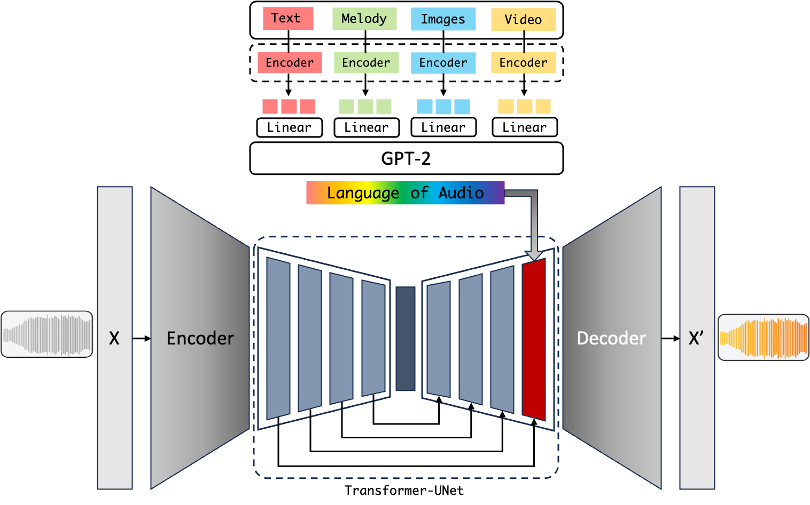
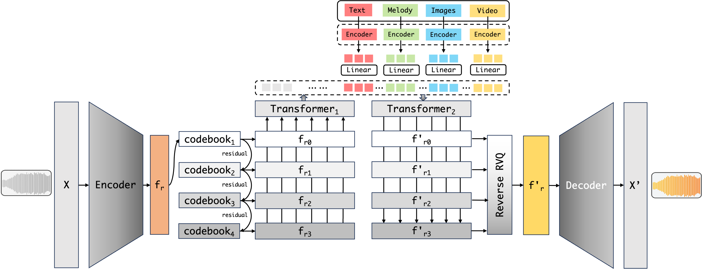

# WeaveWave: Towards Multimodal Music Generation

   

   <i> WeaveWave: Towards Multimodal Music Generation </i>

---

## Overview

Artificial Intelligence Generated Content (AIGC), as a new generation content production paradigm, is reshaping the possibilities in the field of artistic creation. This project focuses on the vertical domain of music generation and conducts a systematic exploration of AI music creation under multimodal input conditions. It proposes three potential multimodal music generation model frameworks:

   

   <i> WeaveWave: Text-Briding </i>

 

   

   <i> WeaveWave: AudioLDM 2 </i>

 

   <i> WeaveWave: Based on MusicGen </i>

 

<!-- **autoregressive**
- MusicLM
- MusicGen
- ...

**non-autoregressive(LDM)**
- Stable Audio Open
- AudioLDM
- ...

<cite>[Audio Conditioning for Music Generation via Discrete Bottleneck Features](http://arxiv.org/abs/2407.12563)</cite>

### 2 directions:

understanding

generation -->

## Demo

  <video src='assets/media/demo.mp4'></video>

  <i> WeaveWave: Web app built with Gradio </i>

<!-- ### Review of Text-bridging multimodal music generation

其实，未尝不是一种 "end-to-end"

自然语言的力量，还没有被完全挖掘 -->
